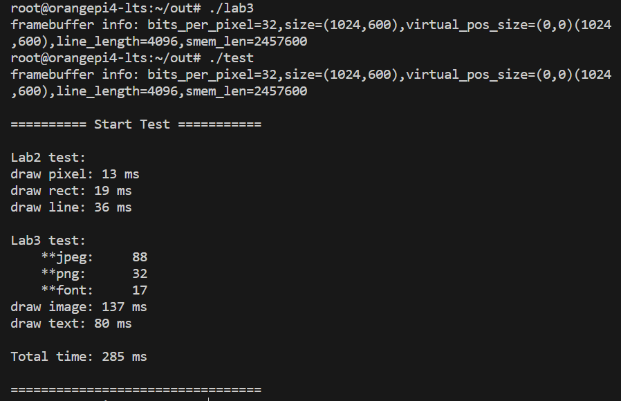
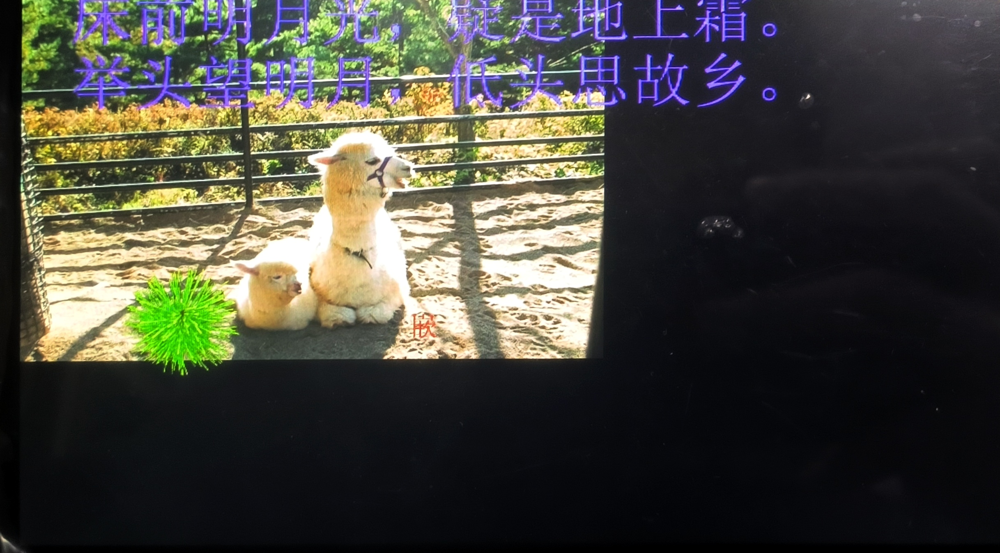
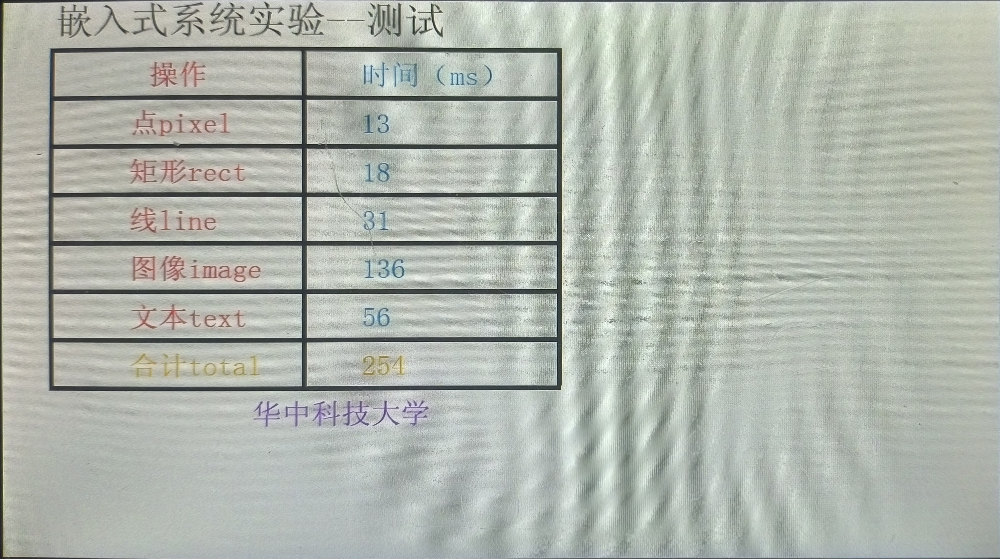
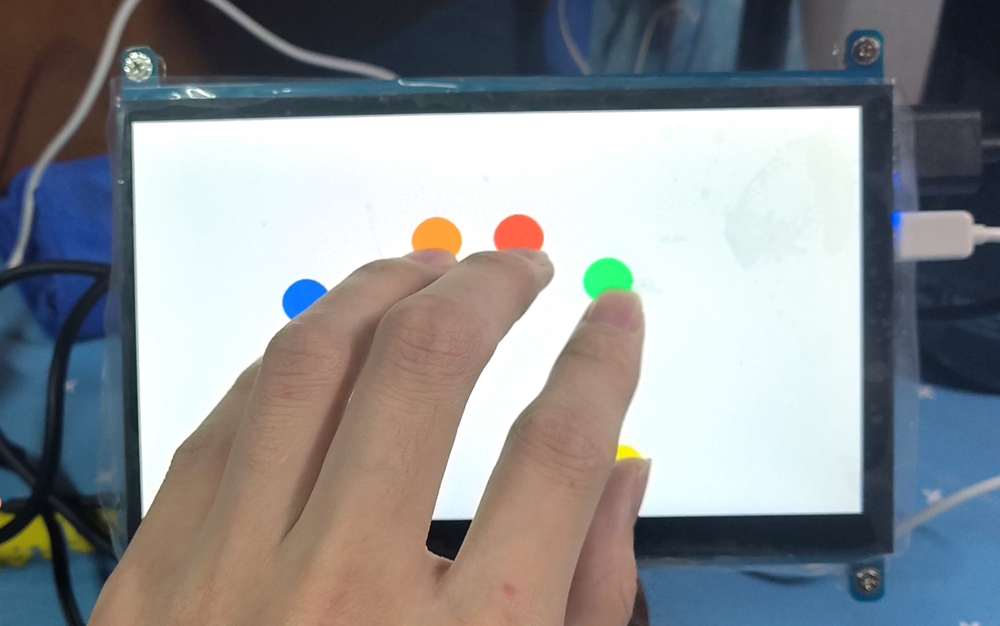
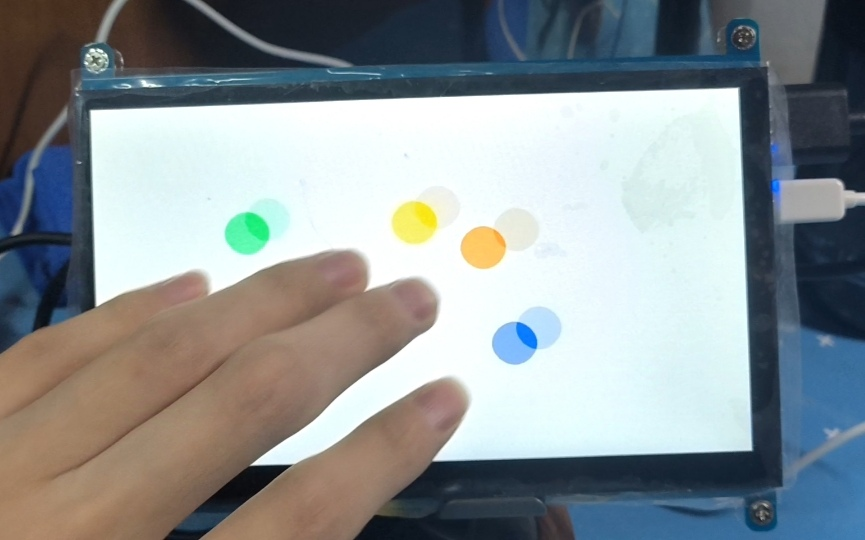

# 嵌入式实验

## 配置环境

### 开发主机和开发板连接热点

`nmcli dev wifi`

`nmcli dev wifi connect wifi_name password wifi_passwd`

`ip addr show wlan0`

### ssh连接到开发机
`ssh root@192.168.183.168`

### 推送到开发机
`scp -r /home/G31415/lab-2022-st/out root@192.168.10.168:/root/out/`

### 修改rules.mk

```makefile
$(EXENAME): $(EXEOBJS)
	$(CC) $(LDFLAGS) -o $(EXENAME) $(EXEOBJS) $(LIB)
	cp $(EXENAME) ../out/
	# scp -r $(EXENAME) root@192.168.10.168:/root/out/
```

去掉注释可以在编译时推送到开发板

## Lab1：简单linux应用程序开发

在Lab1中运行命令`make`，编译，推送

在远程终端运行 `./lab1`


## Labe2：Linux framebuffer显示界面开发

在graphic.c文件中编写绘画函数

#### 实现方法

1. 画块函数，直接两层for循环，设置每个颜色块。

```c++
	int i,j;
    for(i = 0; i < h; i++)
        for(j = 0; j < w; j++)
            *(buf + (i+y)*SCREEN_WIDTH + (j+x)) = color;
```

2. 画线函数，基于整数运算的 **Bresenham 直线算法** 实现

```c++
void fb_draw_line(int x1, int y1, int x2, int y2, int color)
{
    int dx = abs(x2 - x1);
    int dy = abs(y2 - y1);
    int sx = (x1 < x2) ? 1 : -1;
    int sy = (y1 < y2) ? 1 : -1;
    int err = dx - dy;

    while (1) {
		//*(DRAW_BUF + (int)y*SCREEN_WIDTH + (int)x) = color;
        fb_draw_pixel(x1, y1, color);
        if (x1 == x2 && y1 == y2) break;
        int e2 = err * 2;
        if (e2 > -dy) {
            err -= dy;
            x1 += sx;
        }
        if (e2 < dx) {
            err += dx;
            y1 += sy;
        }
    }
}
```

#### 结果


## Labe3：图片显示和文本显示

在graphic.c文件中编写绘画函数

#### 实现方法

1. **jpg：**不需要处理透明度只需要将对应的点加载到缓冲区即可

```c++
if(image->color_type == FB_COLOR_RGB_8880) {
    for(int i = 0; i < h; i++)
        memcpy(dst + i*SCREEN_WIDTH*4,src + i*image->line_byte,w*4);
    return;
}
```

2. **png：** color = color1 * alpha1 + color2 * (1 - alpha1) 

​	(需要逐点计算，并且要单独计算每个颜色通道(r，g，b))

```c++
else if(image->color_type == FB_COLOR_RGBA_8888) {
    for (int i = 0 ; i < h ; i++) {
        for (int j = 0 ; j < w ; j++) {
            char * pcolor = (src + i*image->line_byte + j*4);
            char * p = (char*)((int*)dst+i*SCREEN_WIDTH+j);
            switch (pcolor[3]) {
                case 0: break;
                case 255: p[0] = pcolor[0]; p[1] = pcolor[1]; p[2] = pcolor[2]; 						  break;
                default:
                    p[0] += (((pcolor[0] - p[0]) *pcolor[3])>>8 );
                    p[1] += (((pcolor[1] - p[1]) *pcolor[3])>>8 );
                    p[2] += (((pcolor[2] - p[2]) *pcolor[3])>>8 );
                    break;
            }
        }
    }	
    return;
}
```

3. **font：**于png类似

```c++
for(int i = 0; i < h; i++){
    char* s=src; 
    char* d=dst;
    for(int j = 0; j < w; j++){
        switch (s[0]){
            case 0: break;
            case 255: 
                d[2] = (color & 0xff0000) >> 16; 
                d[1] = (color & 0xff00) >> 8; 
                d[0] = (color & 0xff); 
                break;
            default:
                d[2] += (((((color & 0xff0000) >> 16) - d[2]) * s[0]) >> 8);
                d[1] += (((((color & 0xff00) >> 8) - d[1]) * s[0]) >> 8);
                d[0] += (((((color & 0xff)) - d[0]) * s[0]) >> 8);
                break;
        }
        s++; d+=4;
    }
    dst += SCREEN_WIDTH*4;
    src += image->line_byte;
}
return;
```

#### 结果







## Labe4：Linux touchscreen多点触摸开发

采取第二种方式

- 对应每个手指触点的圆的颜色不同；
- 实时跟踪触点，只显示当前位置；
- 之前位置的圆要清除掉；
- 屏幕不能明显闪烁；

#### 实现方法

1. 以触点为圆心画圆，以手指的接触次序选择颜色
2. 在接触时画圆，移动时把原来的触点填充白色，然后画新的触点
3. 手指离开后填充白色

由于空间有限，不展示代码实现

#### 结果





## Labe5：蓝牙无线互联通讯


## Labe6：综合实验


