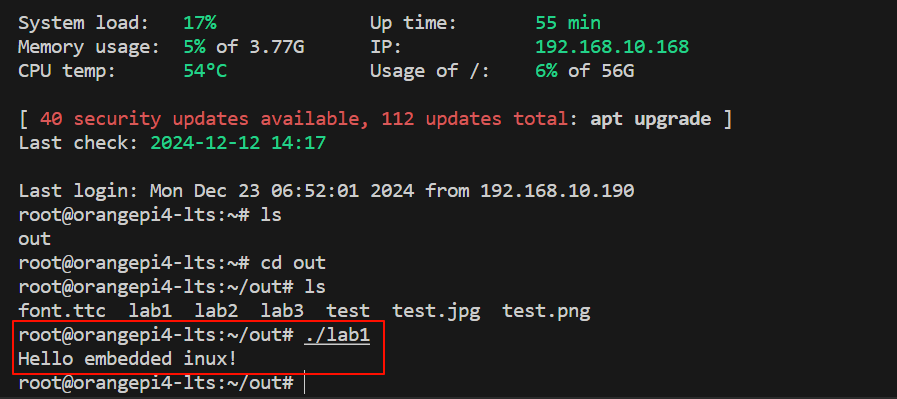
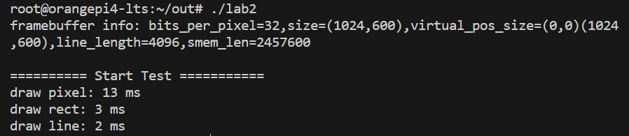
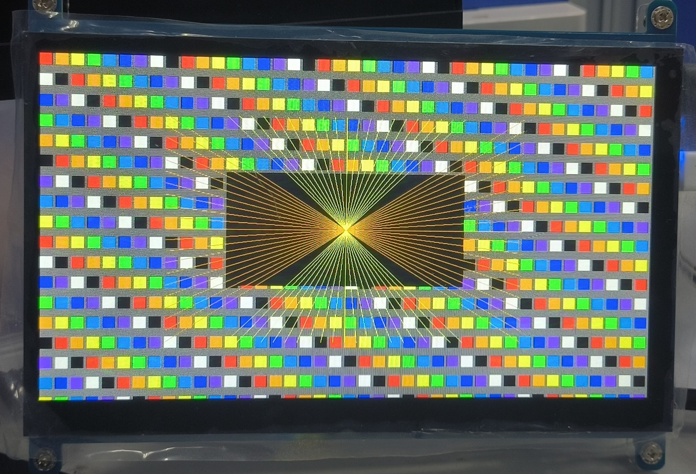

# 嵌入式实验

## 配置环境

### 开发主机和开发板连接热点

`nmcli dev wifi`

`nmcli dev wifi connect wifi_name password wifi_passwd`

`ip addr show wlan0`

### ssh连接到开发机
`ssh root@192.168.183.168`

### 推送到开发机
`scp -r /home/G31415/lab-2022-st/out root@192.168.10.168:/root/out/`

### 修改rules.mk

```makefile
$(EXENAME): $(EXEOBJS)
	$(CC) $(LDFLAGS) -o $(EXENAME) $(EXEOBJS) $(LIB)
	cp $(EXENAME) ../out/
	# scp -r $(EXENAME) root@192.168.10.168:/root/out/
```

去掉注释可以在编译时推送到开发板

## Lab1：简单linux应用程序开发

在Lab1中运行命令`make`，编译，推送

在远程终端运行 `./lab1`



## Labe2：Linux framebuffer显示界面开发

在graphic.c文件中编写绘画函数

#### 实现方法

1. 画块函数，直接两层for循环，设置每个颜色块。

```c++
	int i,j;
    for(i = 0; i < h; i++)
        for(j = 0; j < w; j++)
            *(buf + (i+y)*SCREEN_WIDTH + (j+x)) = color;
```

1. 画线函数，基于整数运算的 **Bresenham 直线算法** 实现

```c++
void fb_draw_line(int x1, int y1, int x2, int y2, int color)
{
    int dx = abs(x2 - x1);
    int dy = abs(y2 - y1);
    int sx = (x1 < x2) ? 1 : -1;
    int sy = (y1 < y2) ? 1 : -1;
    int err = dx - dy;

    while (1) {
		//*(DRAW_BUF + (int)y*SCREEN_WIDTH + (int)x) = color;
        fb_draw_pixel(x1, y1, color);
        if (x1 == x2 && y1 == y2) break;
        int e2 = err * 2;
        if (e2 > -dy) {
            err -= dy;
            x1 += sx;
        }
        if (e2 < dx) {
            err += dx;
            y1 += sy;
        }
    }
}
```

#### 结果





## Labe3：图片显示和文本显示


## Labe4：Linux touchscreen多点触摸开发


## Labe5：蓝牙无线互联通讯


## Labe6：综合实验


